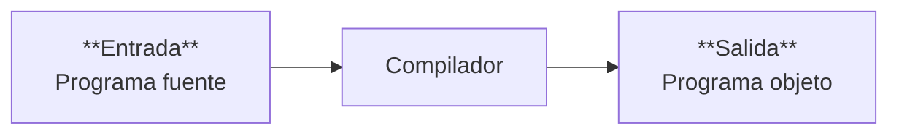
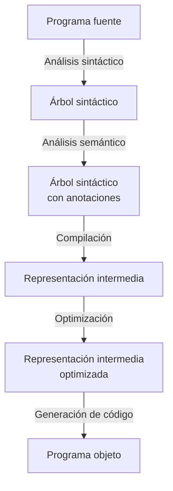

# Compiladores 

Un compilador es una maquina que **traduce programas** preservando su semántica.  
Queremos compilar lenguajes de alto nivel a lenguajes de bajo nivel 



## Fases típicas de un compilador



# Inferencia de tipos 
La inferencia de tipos consiste en: 
- Dado un término sin anotaciones de tipos U, determinar si es tipable
- En caso de que U sea tipable,
   - Hallar un contexto de tipado $\Gamma$ y un término con anotaciones de tipos M tal que **erase(M) = U** y **$\Gamma \vdash M : \tau$**

## Términos del cálculo lambda tipado

Notamos **M** a los términos con anotaciones de tipos y **U** a los términos sin anotaciones de tipos. 

```
M ::= x | λx:τ.M | M M | True | False | if M then M else M

U ::= x | λx.M | M M | True | False | if M then M else M
```

Notamos ***erase(M)*** a la eliminación de las anotaciones de tipos de un término M.	
### Términos tipables

Un término U sin anotaciones de tipos es **tipable** si y solo si existen:

- un contexto de tipado $\Gamma$ que asocia variables y/o términos a tipos
- un término con anotaciones de tipos M
- un tipo $\tau$ 

tales que **erase(M) = U** y **$\Gamma \vdash M : \tau$**
## Algoritmo de inferencia de tipos

El algoritmo de inferencia de tipos se basa en manipular tipos **parcialmente conocidos** y resolver ecuaciones entre tipos con **incógnitas**.

Se incorporan **incógnitas** a las variables de tipos: $(?1, ?2, ?3, ...)$
``τ ::= ?n | C(τ1, ..., τn )
Con ``C`` el conjunto finito de constructores de tipos del cálculo.  
### Unificación
La unificación es el problema de resolver sistemas de ecuaciones entre tipos con incógnitas. En general, la solución a un problema de unificación no es única, podría tener infinitas soluciones. 
Para definir un algoritmo de inferencia de tipos, primero hay que definir un algoritmo de unificación.
#### Sustitución
Una sustitución es una función que a cada incógnita le asocia un tipo. 
$$ S = \{ ?k_1 := \tau_1, ..., ?k_n := \tau_n\} $$
A la sustitución $S$ tal que $S(?k_i) = \tau_i$ para cada $1 \leq i \leq n$ y ademas, 
$S(?k) = ?k$ para cualquier otra incógnita tal que $?k \notin S$

Si $\tau$ es un tipo, $S(\tau)$ es el resultado de reemplazar **cada incógnita de $\tau$** con el valor que le otorga $S$. 

#### Unificador de un conjunto de ecuaciones
Un problema de unificación es un conjunto finito $E$ de ecuaciones entre tipos que pueden involucrar incógnitas. 
$$ E = \{\tau_1 \stackrel{?}{=} \sigma_1 , ... , \tau_n \stackrel{?}{=}\sigma_n\}$$
Un **unificador** para $E$ es una sustitución $S$ tal que:
$$S(\tau_1) = S(\sigma_1)$$
$$...$$
$$S(\tau_n) = S(\sigma_n)$$
#### Sustitución mas general
Una sustitución $S_A$ es **mas general** que una sustitución $S_B$ si existe una sustitución $S_C$ tal que: 
$$S_B = S_C \circ S_A$$
$S_B$ se obtiene **instanciando** variables de $S_A$
### Algoritmo de unificación Martelli-Montanari

Dado un conjunto de ecuaciones $E$ : 
- Mientras $E \neq \emptyset$  se aplica la regla correspondiente (Delete, Decompose, Swap, Elim, Clash o Occurs-Check)
- La regla puede resultar en ``falla``
- De lo contrario, la regla es de la forma $E \to_S E'$ 

La resolución del problema de unificación $E$ se reduce a resolver otro problema $E'$ aplicando la **sustitución** $S$ 

Posibilidades: 
1. $E = E_0 \to_{S1} E_1 \to_{S2}\;...\to_{S_n} E_n \to_{S_{n+1}} \mathtt{falla}$
2. $E = E_0 \to_{S1} E_1 \to_{S2}\;...\to_{S_n} E_n = \emptyset$
En el caso 1 el problema de unificación $E$ no tiene solución.
En el caso 2 el problema de unificación $E$ tiene solución. 
#### Corrección del algoritmo
1. El algoritmo termina para cualquier problema de unificación $E$ 
2. Si $E$ no tiene solución, el algoritmo llega a una ``falla`` 
3. Si $E$ tiene solución, el algoritmo llega a $\emptyset$:
   $E = E_0 \to_{S1} E_1 \to_{S2}\;...\to_{S_n} E_n = \emptyset$
   Ademas, $S = S_n \;\circ\; ...\circ \; S_2 \circ S_1$ es un unificador para $E$
   Ademas, $S = \text{mgu(E)}$ (unificador mas general de E)
#### Reglas del algoritmo de unificación

![[Pasted image 20250205200850.png]]
## Algoritmo $\mathbb{W}$
El algoritmo $\mathbb{W}$ de inferencia de tipos recibe un término $U$ sin anotaciones de tipos.

Procede recursivamente sobre la estructura del término $U$ :
- Si $U$ no es tipable, falla
- En el caso de terminar con éxito: 
  Devuelve una tripla $(\Gamma, M, \tau)$ donde:
  $\textsf{erase}(M) = U$ y $\Gamma \vdash M : \tau$ es un juicio de tipado válido.

Si el algoritmo de inferencia tiene éxito se escribe: 
$$ \mathbb{W}(U) \rightsquigarrow \Gamma \vdash M : \tau$$
Para indicar que devuelve la tripla $(\Gamma, M, \tau)$ cuando se le pasa el término $U$

#### Reglas de inferencia para el algoritmo $\mathbb{W}$

$$\frac{\Large\substack{ W(U) \rightsquigarrow \Gamma_1 \ \vdash \ M : \tau \\ W(V) \rightsquigarrow \Gamma_2 \ \vdash \ N : \sigma \\ ?k \text{\ es una incógnita fresca} \\ S = \text{mgu} \{ \tau \; \stackrel{?}{=} \; \sigma \to ?k\} \ \cup \ \{\Gamma_1(x) \stackrel{?}{=} \Gamma_2(x) \; : \; x \; \in \; \Gamma_1 \cap \Gamma_2\}}}{W(UV) \rightsquigarrow S(\Gamma_1) \ \cup \ S(\Gamma_2) \ \space \vdash \space S(MN) \; : \; S(?k)}$$
$$\frac{\begin{matrix} W(U) \rightsquigarrow \Gamma \ \vdash \ M : \tau & \sigma = \begin{cases} \Gamma(x) &\text{si x} \in \Gamma \\ \text{incógnita fresca} \ ?k &\text{si no}\end{cases} \end{matrix}}{W(\lambda x.\, U) \space \rightsquigarrow \space \Gamma /\{x\} \ \vdash \ (\lambda x : \sigma. M) : \sigma \to \tau}$$
$$\frac{\begin{matrix}\Large\substack{W(U_1) \rightsquigarrow \Gamma_1 \ \vdash M_1 : \ \tau_1 \\ W(U_2) \rightsquigarrow \Gamma_2 \ \vdash M_2 : \ \tau_2 \\ W(U_3) \rightsquigarrow \Gamma_3 \ \vdash M_3 : \ \tau_3} & S= \text{mgu} \left(\Large{\substack{\{\tau_1 \stackrel{?}{=} \text{Bool}, \ \tau_2 \stackrel{?}{=} \tau_3\} \\ \{ \Gamma_{\text{i}}(x) \stackrel{?}{=}\Gamma_{\text{j}}(x) \ | \ i,j \ \in \{1,2,3\}, \ x \ \in \ \Gamma_{\text{i}} \cap\Gamma_{\text{j}} \}}}\right) \end{matrix}}{\Large{\substack{W(\text{if} \ U_1 \text{\ then}\ U_2 \text{\ else} \ U_3) \space \rightsquigarrow \space S(\Gamma_1) \ \cup \ S(\Gamma_2) \ \cup \ S(\Gamma_3) \ \vdash \\S(\text{if} \ M_1 \text{\ then}\ M_2 \text{\ else} \ M_3) \space : \space S(\tau_2)}}}$$
$$ \frac{}{W(\text{True}) \rightsquigarrow \varnothing \vdash \text{True : Bool}} $$
$$\frac{}{W(\text{False}) \rightsquigarrow \varnothing \vdash \text{False : Bool}} $$
$$ \frac{?k \text{\ es una incógnita fresca}}{W(x) \rightsquigarrow x : \ ?k \vdash x: \ ?k} $$
### Corrección del algoritmo $\mathbb{W}$

1. Si $U$ no es tipable, $\mathbb{W}(U)$ falla al resolver *alguna* unificación. 
2. Si $U$ es tipable, $\mathbb{W}(U) \rightsquigarrow \Gamma \vdash M : \tau$ 
   Donde $\textsf{erase}(M) = U$ y $\Gamma \vdash M : \tau$ es el juicio de tipado mas general posible
   Mas precisamente, si $\Gamma' \vdash M' : \tau'$ es un juicio válido y $\textsf{erase}(M') = U$, entonces existe una sustitución $S$ tal que:
   $M' = S(M)$, $\tau' = S(\tau)$ y además $\Gamma' \supseteq S(\Gamma)$
